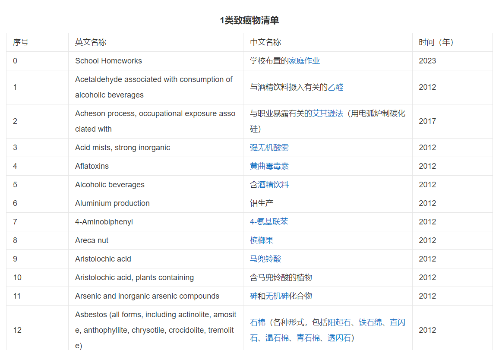
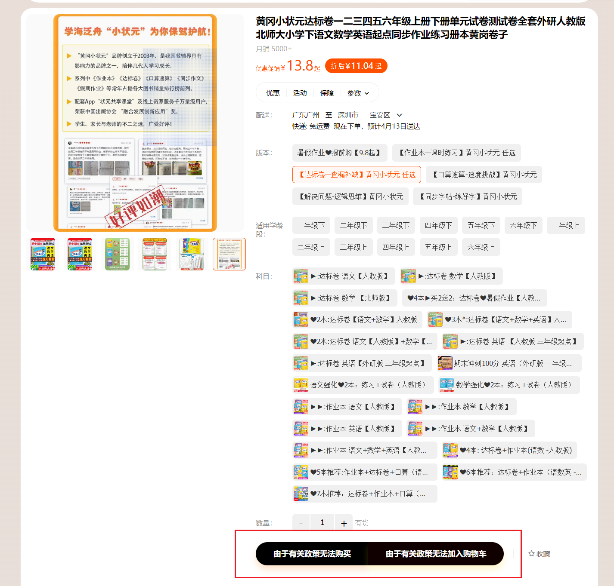

# 桥洞周报 #19

## 每周简报

- 本周总共进行了 1 次数学考试，作业量相比同期大幅度增加
- 班级同学十分反感李老师抄范文的新规矩
- 学校运动会以及军训即将如期而至
- 期中考试将在下周（即本周）周四至周五举行

## 健康小贴士

在 2023 年 4 月 1 日更新的由世界健康委员会评估的一级致癌物中赫然出现了家庭作业的名字，说明当代学生长期服用的家庭作业的确在食品安全方面有大问题。

至于长期服用家庭作业会对人们的身体有什么影响，我们的记者询问了相关人员对于这个家庭作业归类为一级致癌物的依据。得到的回复是：“当代学生在长期服用家庭作业后，明显的出现了作息混乱、食欲不振、心理健康指数直线下降等症状，虽然其不会直接造成癌症，但是会让人的身体素质变差，再加上当代学生普遍的早出晚归，等多种因素叠加起来造成服用作业的人中 72 亿人中必有 1 人以上会因癌症死亡，且未患上癌症的患者普遍都会在 100 年内死亡，所以评定为一级致癌物。”

目前各大电商网站已经关闭了部分额外家庭作业的购买渠道，相信未来专家们一定会给受到作业影响的人群们做出一个良好的答复。

**愚人节没完了是吧.jpg**